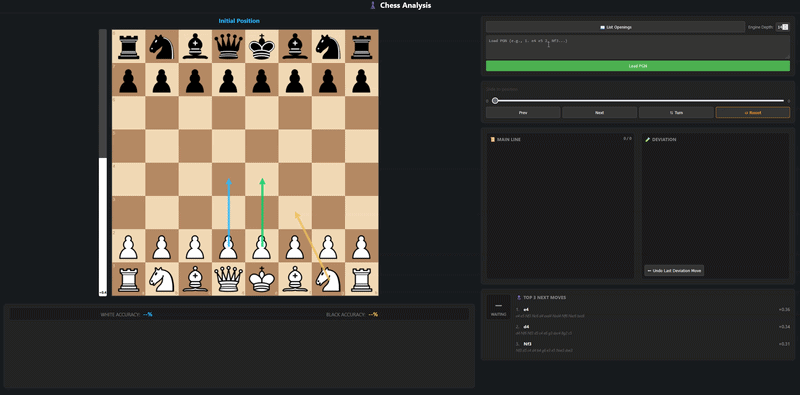

# Chess Analysis App

A real-time chess analysis web app powered by Stockfish engine, Flask backend, and a reactive browser UI. It supports move validation, PGN import, opening detection, blunder classification, and live evaluation visualization.


---

## ⚙️ Features

- Live board powered by chessboard.js  
- Engine analysis via Stockfish  
- Top-3 move suggestions with continuations  
- Eval bar (centipawn + mate detection)  
- Move classification (Blunder → Brilliant)  
- Opening recognition from PGN database  
- PGN loader with timeline navigation  
- Variation tracking (main line vs deviations)  
- Legal move validation API  

---

## 🚀 Quick Start (Docker)

### 1. Clone repo
```bash
git clone https://github.com/MarcoOnorato/chess_engine_analyzer_app.git
```

### 2. Get stockfish
- download from [https://stockfishchess.org/download/](https://stockfishchess.org/download/) (container is ubuntu, local development with python is your os)
- extract and copy into project folder

### 2. Build image

```bash
docker build --build-arg STOCKFISH_BINARY=stockfish/stockfish-ubuntu-x86-64-avx2 -t chess-engine-analyzer .
```
  Replace STOCKFISH_BINARY with your Stockfish binary relative path, sould always be something like "stockfish/stockfish-version".

### 3. Run container

```bash
docker run --name chess-engine-analyzer -p 5000:5000 chess-engine-analyzer
```

### 4. Open app
http://localhost:5000


## Requirements
- Docker (or just set stockfish binary path in python and run from python)
- Stockfish [https://stockfishchess.org/download/](https://stockfishchess.org/download/)

## Credits
For openings:
- https://github.com/tomgp/chess-canvas
- https://www.pgnmentor.com/files.html#openings
