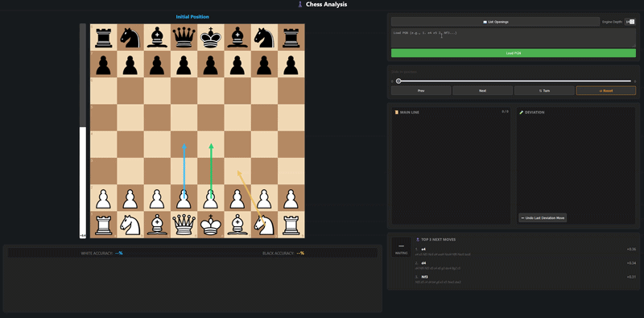
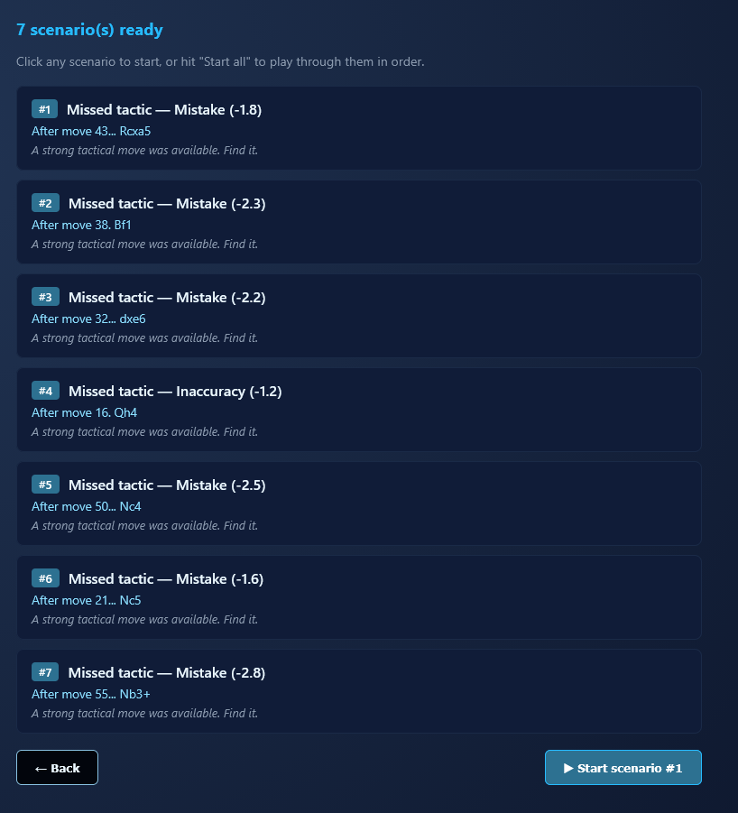

# Chess Analysis App

A real-time chess analysis web app powered by Stockfish engine, Flask backend, and a reactive browser UI. It supports move validation, PGN import, opening detection, blunder classification, and live evaluation visualization.

## Overview

### Game Review


---

### Training



---

## ⚙️ Features

- Live board powered by chessboard.js  
- Engine analysis via Stockfish  
- Top-3 move suggestions with continuations  
- Eval bar (centipawn + mate detection)  
- Move classification (Blunder → Brilliant)  
- Opening recognition from PGN database  
- PGN loader with timeline navigation  
- Variation tracking (main line vs deviations)  
- Legal move validation API
- Chess.com and Lichess support to analyze a player public games
- **Player DB (optional)** — personal profiles + stats dashboard (see below)

---

## 👤 Player DB (optional feature)

Create personal profiles for any public Lichess / Chess.com player, import their
N most recent games (analyzed at a depth you choose), and browse an aggregate
**dashboard**: win rate (overall and by color), openings played, accuracy trend,
per-phase accuracy, move-quality distribution (Brilliant → Blunder) and more.
Reach it from the **Players** tab in the top navigation (`/players`).

- Storage is a local **SQLite** file (stdlib `sqlite3`, no extra dependency).
- Ingestion runs as a **background job** with live progress; you can navigate away.
- Games are de-duplicated by PGN content, so re-importing the "latest 40" only
  analyzes what's new. Re-importing at a **different depth** asks before it
  recomputes existing entries.

It is **enabled by default** and isolated in the `player_db/` package. Turn it
off with `PLAYER_DB_ENABLED=0` (then `/players` and its API are not mounted and
no DB file is created).

Config env vars:

| Var | Default | Meaning |
| --- | --- | --- |
| `PLAYER_DB_ENABLED` | `1` | `0` to disable the whole feature |
| `PLAYER_DB_PATH` | `data/player_db.sqlite` | SQLite file location |

**Python:**
```bash
# enabled by default
python app.py
# or explicitly disable
PLAYER_DB_ENABLED=0 python app.py
```

**Docker** — mount a volume at `/app/data` so the DB persists across runs:
```bash
docker run --name chess-engine-analyzer -p 5000:5000 \
  -v chessdb:/app/data chess-engine-analyzer
```

---

## 🚀 Quick Start (Docker)

### 1. Clone repo
```bash
git clone https://github.com/MarcoOnorato/chess_engine_analyzer_app.git
```

### 2. Get stockfish
- download from [https://stockfishchess.org/download/](https://stockfishchess.org/download/) (container is ubuntu, local development with python is your os)
- extract and copy into project folder

### 2. Build image

```bash
docker build --build-arg STOCKFISH_BINARY=stockfish/stockfish-ubuntu-x86-64-avx2 -t chess-engine-analyzer .
```
  Replace STOCKFISH_BINARY with your Stockfish binary relative path, sould always be something like "stockfish/stockfish-version".

### 3. Run container

```bash
docker run --name chess-engine-analyzer -p 5000:5000 chess-engine-analyzer
```

### 4. Open app
http://localhost:5000


## Requirements
- Docker (or just set stockfish binary path in python and run from python)
- Stockfish [https://stockfishchess.org/download/](https://stockfishchess.org/download/)

## Credits
For openings:
- https://github.com/tomgp/chess-canvas
- https://www.pgnmentor.com/files.html#openings
