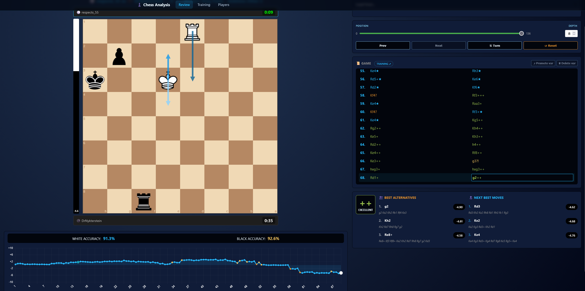
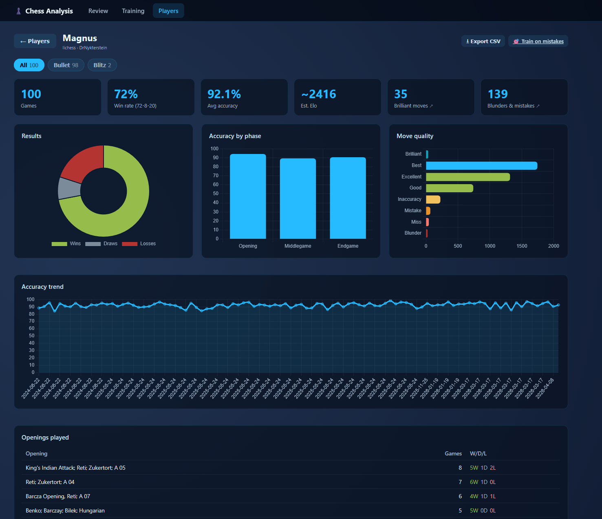
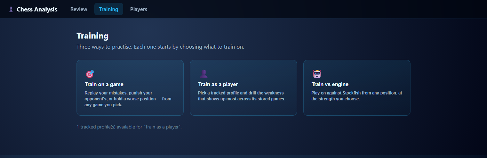
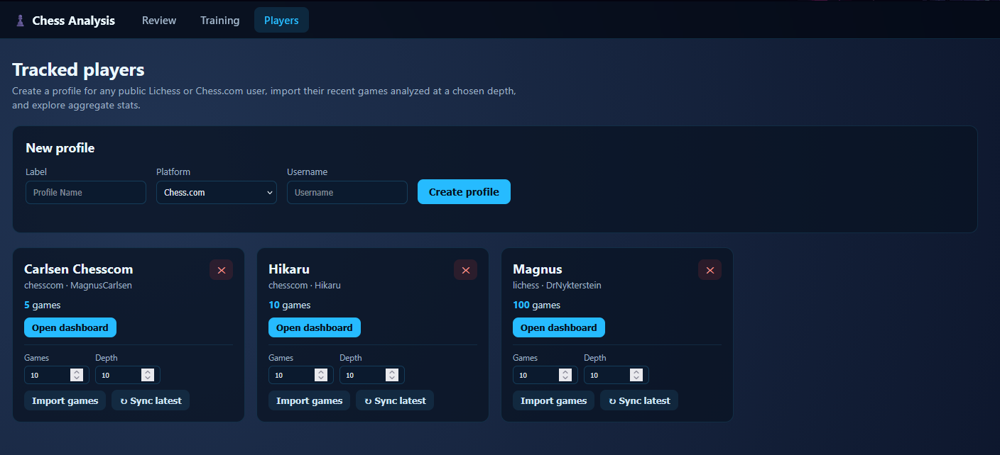

# ♟️ Chess Analysis App

A real-time chess analysis web app powered by the **Stockfish** engine, a **Flask**
backend and a reactive, dependency-light browser UI. Review any game move by move,
drill your weaknesses against the engine, and keep a personal database of any public
Lichess / Chess.com player with an aggregate stats dashboard.

Runtime dependencies are just **Flask** and **python-chess** — no build step, no JS
bundler, no ORM. The browser UI is plain ES modules; storage is a single SQLite file
from the standard library.

> Not affiliated with chess.com, lichess.org, or any other organization.

---

## 📸 At a glance

### Game Review — engine eval, move classification, and on-board clocks


Top-3 engine lines, an eval bar, Brilliant → Blunder move classification, variation
tracking, and — when the source PGN carries `[%clk]` times — each player's clock right
on the board, updating as you step through the moves.

### Player DB — a full stats dashboard for any tracked player


---

## ⚙️ Features

**Review**
- Live board (chessboard.js) with legal-move validation
- Stockfish analysis with top-3 moves and continuations
- Eval bar (centipawns + forced-mate detection)
- Move classification: Blunder, Mistake, Miss, Inaccuracy, Good, Excellent, Best, Brilliant
- Opening recognition from a bundled PGN database
- Per-side **accuracy** and an **estimated Elo** — see [the model](#-accuracy--estimated-elo) below
- PGN loader with a full variation tree (main line vs sidelines) and timeline navigation
- **Move clocks on the board** when the PGN has `[%clk]` times (Lichess/Chess.com)
- Import and analyze any public Chess.com or Lichess game

**Training** — three ways to practise, each starting from a game you pick

- **Train on a game** — replay your mistakes or punish your opponent's
- **Train as a player** — drill the weakness that shows up most across a tracked profile
- **Train vs engine** — play on against Stockfish from any position, at a chosen strength

**Player DB** — see [below](#-player-db-optional-feature).

---

## 📈 Accuracy & estimated Elo

Both Review and the Player DB report a per-side **accuracy %** and a rough **estimated
Elo**. They use a **win-probability** model (à la Lichess), not raw centipawn loss:

- A position eval is mapped to a win chance: `winPercent(cp) = 100 / (1 + e^(−0.00368208·cp))`.
- A move's penalty is the **win %** it gave away, so the same centipawn slip costs a lot
  near equality and almost nothing in an already-decided position.
- Per-move accuracy: `accuracy(Δwin%) = 103.1668·e^(−0.04354·Δ) − 3.1669`, clamped to `[0, 100]`.
- Game accuracy maps to Elo with `elo = A + B / (100 − accuracy)` (clamped) — a
  two-parameter fit to real Lichess ratings from ingested games (a ~1300 blitz player scores
  ~85%, a ~1540 rapid player ~88%, and Carlsen ~93%). Accuracy compresses hard near 100%, so
  Elo rises with the reciprocal of the imperfection.

This is why the same accuracy means very different things at 400 vs 2700 — a weaker
player's errors land where the win chance is volatile and get punished accordingly. The
Elo figure is a deliberately-rough, clearly-labeled heuristic, not a rating computation.

The math lives in one place per side and is kept in sync: `player_db/stats.py` (backend)
and `static/js/accuracy.js` + `static/js/game-review.js` (browser).

---

## 👤 Player DB (optional feature)

Create a profile for any public Lichess / Chess.com player, import their recent games
(analyzed at a depth you choose), and browse an aggregate **dashboard**: win rate
(overall and by colour), openings played, accuracy trend, per-phase accuracy, estimated
Elo, move-quality distribution and per-time-control breakdown. Reach it from the
**Players** tab (`/players`).



The dashboard adds:

- **↻ Sync latest** — one-click incremental import that adds only games not already
  stored, at the same depth as the rest of the profile.
- **Brilliant / Blunder explorers** — click a KPI to browse the player's best or worst
  moves as mini-boards, each deep-linking into Review at the exact ply.
- **Time management** — think-time per move (overall and by phase) and how many mistakes
  were made in time trouble, parsed from the PGN clocks. Think-time also shows on the
  explorer boards.
- **🎯 Train on mistakes** — jumps straight into "Train as a player" for the profile.
- **⭳ Export CSV** — download the games list (respecting the active time-control filter).

How it works:

- Storage is a local **SQLite** file (stdlib `sqlite3`, no extra dependency).
- Ingestion runs as a **background job** with live progress; you can navigate away.
- Per-move analysis is stored, so accuracy / Elo can be recomputed without re-running the
  engine (a schema migration runs once on startup, guarded by SQLite's `user_version`).
- Games are de-duplicated by PGN content, so re-importing the "latest 40" only analyzes
  what's new. Re-importing at a **different depth** asks before it recomputes existing entries.

The feature is **enabled by default** and isolated in the `player_db/` package. Turn it
off with `PLAYER_DB_ENABLED=0` (then `/players` and its API are not mounted and no DB
file is created).

| Env var | Default | Meaning |
| --- | --- | --- |
| `PLAYER_DB_ENABLED` | `1` | `0`/`false`/`off` to disable the whole feature |
| `PLAYER_DB_PATH` | `data/player_db.sqlite` | SQLite file location |
| `STOCKFISH_PATH` | `windows_stockfish\stockfish-windows-x86-64-avx2.exe` | Stockfish binary path |
| `LOG_LEVEL` | `INFO` | Logging verbosity (`DEBUG`, `INFO`, `WARNING`, …) |

---

## 🚀 Quick start

### Python (local dev)

```bash
# 1. install (dependencies come from pyproject.toml)
pip install .

# 2. get Stockfish: https://stockfishchess.org/download/
#    then point STOCKFISH_PATH at the binary (or drop it where the default expects)

# 3. run — Player DB enabled by default
python app.py
# ...or without it
PLAYER_DB_ENABLED=0 python app.py
```

Open http://localhost:5000

### Docker

```bash
# 1. clone
git clone https://github.com/MarcoOnorato/chess_engine_analyzer_app.git

# 2. get Stockfish (the container is Ubuntu) and copy it into the project folder
#    https://stockfishchess.org/download/

# 3. build — STOCKFISH_BINARY is the binary's path relative to the project,
#    e.g. stockfish/stockfish-ubuntu-x86-64-avx2
docker build --build-arg STOCKFISH_BINARY=stockfish/stockfish-ubuntu-x86-64-avx2 \
  -t chess-engine-analyzer .

# 4. run — mount a volume at /app/data so the Player DB persists across runs
docker run --name chess-engine-analyzer -p 5000:5000 \
  -v chessdb:/app/data chess-engine-analyzer
```

---

## 🗂️ Project layout

```
app.py              Flask entry point + Review/PGN API routes
analysis_core.py    Stockfish wrapper: analysis, move classification, opening book
player_db/          Optional Player DB feature (routes, ingest, SQLite, stats)
  ├─ routes.py      /players blueprint + JSON API
  ├─ ingest.py      background analysis worker (one job, one engine, at a time)
  ├─ sources.py     Lichess / Chess.com game fetching
  ├─ db.py          SQLite schema + queries
  └─ stats.py       accuracy / Elo / phase aggregation (mirrors the JS)
static/js/          plain ES modules (no bundler): board, PGN tree, review, training
templates/          Jinja pages
tests/              pytest suite (no engine, no network)
```

---

## 🧪 Development

Dependencies and tooling are declared in `pyproject.toml` (single source of truth).

```bash
pip install ".[dev]"   # pytest, ruff, mypy
pytest                 # 141 unit tests — no engine, no network
ruff check .
mypy .
```

The test suite stubs out Stockfish and the network, so it runs fast and offline: the
analysis math (accuracy, Elo, phases), the SQLite layer, ingestion planning and the
Lichess/Chess.com source parsers are all covered without external dependencies.

## Requirements
- Python 3.12+ (or Docker)
- Stockfish — https://stockfishchess.org/download/

## Credits
Openings data:
- https://github.com/tomgp/chess-canvas
- https://www.pgnmentor.com/files.html#openings
